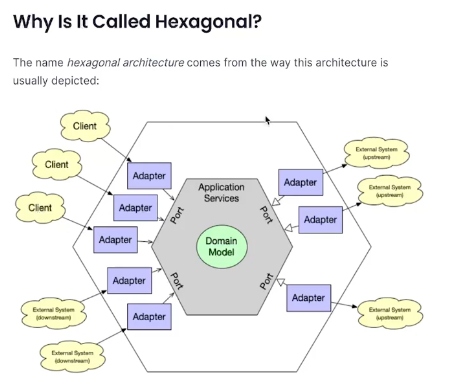

# Layered Architecture
- 단점 때문에 대두되고 있는것이 Hexagonal Architecture
- Hexagonal Architecture 는 레이어드 아키텍처의 단점을 보완하기 위해 나온 아키텍처

### 아래 Order 라는 도메인 객체를 잘 보자.
```java
package sample.cafekiosk.spring.domain.order;

import lombok.AccessLevel;
import lombok.Getter;
import lombok.NoArgsConstructor;
import sample.cafekiosk.spring.domain.BaseEntity;
import sample.cafekiosk.spring.domain.orderProduct.OrderProduct;
import sample.cafekiosk.spring.domain.product.Product;

import javax.persistence.CascadeType;
import javax.persistence.Entity;
import javax.persistence.EnumType;
import javax.persistence.Enumerated;
import javax.persistence.GeneratedValue;
import javax.persistence.GenerationType;
import javax.persistence.Id;
import javax.persistence.OneToMany;
import javax.persistence.Table;
import java.time.LocalDateTime;
import java.util.ArrayList;
import java.util.List;
import java.util.stream.Collectors;

@Getter
@NoArgsConstructor(access = AccessLevel.PROTECTED)
@Table(name = "orders")
@Entity
public class Order extends BaseEntity {

    @Id @GeneratedValue(strategy = GenerationType.IDENTITY)
    private Long id;

    @Enumerated(EnumType.STRING)
    private OrderStatus orderStatus;

    private int totalPrice;

    private LocalDateTime registeredDateTime;

    @OneToMany(mappedBy = "order", cascade = CascadeType.ALL)
    private List<OrderProduct> orderProducts = new ArrayList<>();


    public Order(List<Product> products, LocalDateTime registeredDateTime) {
        this.orderStatus = OrderStatus.INIT;
        this.totalPrice = calculateTotalPrice(products);
        this.registeredDateTime = registeredDateTime;
        this.orderProducts = createOrderProducts(products);
    }

    private List<OrderProduct> createOrderProducts(final List<Product> products) {
        return products.stream()
                .map(product -> new OrderProduct(this, product))
                .collect(Collectors.toList());
    }

    private int calculateTotalPrice(final List<Product> products) {
        return products.stream()
                .mapToInt(Product::getPrice)
                .sum();
    }

    public static Order create(final List<Product> products, LocalDateTime registeredDateTime) {
        return new Order(products, registeredDateTime);
    }
}
```

### Order 가 가지고 있는 도메인 로직들
- 총금액을 계산한다던가, 분리가 되어야 하지 않을까
- 도메인 객체라고 부르고 있는 객체가 데이터베이스와 너무 강결합인것
- 특히 JPA 기술과 땔래야 땔수가없는 관계이다.
- OrderRepository 를 보아도, 데이터를 Access 를 하기위한 repository 를 선언했는데, JpaRepository 를 상속해서 사용하고 있다보니,  
- JPA 가 너무 깊이 침투해서 기술에 대한 의존성이 너무 강하다.
- 그래서 나온게 Hexagonal Architecture 이다.

# Hexagonal Architecture
- 
- 육각형에 특이한 뜻이 있는것은 아니고, 도메인 비즈니스가 가장 한가운데 있고,
- 둘러싸고있는 포트들이 외부와 통신하는 입출력 포트라고 생각하면 된다.
- 외부의 시스템들이 어뎁터를 통해서 접근한다 라고 이해하면 되고,
- 이 도메인 모델 자체가 양파로 치면 가장 가운데 있고, 어뎁터와 포트라는 추상적인것들을 통해서, 접근할 수 있는것이다.
- 도메인은 외부의 것들을 전혀 모르는것이다. (도메인 모델은 JPA 라는 기술을 전혀 모르는것이 핵심.)
- 이런게 어떻게 가능하냐 -> 스프링의 DI 라는 개념을 확장시켜서 활용을 하면, 데이터 엑세스를 위한 Repository 인터페이스를 따로 두고, 얘를 구현하는 JpaRepository 를 따로 두어서 런타임 시점에 주입을 해준다면, 실제 우리가 구현한    

# 단위 테스트 vs 통합 테스트
- 단위 테스트는 도메인 모델을 테스트하는것이고, 통합 테스트는 외부 시스템과의 통합을 테스트하는것이다.

# IoC, DI, AOP

# ORM, 패러다임의 불일치, hibernate

# QueryDSL
- QueryDSL 은 JPA 를 사용할때, 동적 쿼리를 작성하기 위해서 사용하는 라이브러리이다.
- 컴파일 단계에서 에러를 잡아낼 수 있다.
- 코드를 작성하는 시점에 타입체크가 되고, 동적으로 쿼리를 작성할 수 있다.

# Spring Data JPA
- Spring Data JPA 는 JPA 를 사용할때, 더 편리하게 사용할 수 있도록 도와주는 라이브러리이다.

# Spring Data JPA vs QueryDSL
- Spring Data JPA 는 JPA 를 사용할때, 더 편리하게 사용할 수 있도록 도와주는 라이브러리이다.
- QueryDSL 은 JPA 를 사용할때, 동적 쿼리를 작성하기 위해서 사용하는 라이브러리이다.

# SpringBootTest vs DataJpaTest
- SpringBootTest 는 통합 테스트를 위한 어노테이션이고, DataJpaTest 는 JPA 를 사용할때, 테스트를 위한 어노테이션이다.

# SpringBootTest vs WebMvcTest
- SpringBootTest 는 통합 테스트를 위한 어노테이션이고, WebMvcTest 는 MVC 를 사용할때, 테스트를 위한 어노테이션이다.

# Optimistic Lock, Pessimistic Lock
- Optimistic Lock 은 낙관적인 락이고, Pessimistic Lock 은 비관적인 락이다.
- Optimistic Lock 은 트랜잭션을 커밋하기전에, 데이터베이스에서 데이터가 변경되었는지 확인하는 방식이다.
- Pessimistic Lock 은 트랜잭션을 커밋하기전에, 데이터베이스에서 데이터를 락을 걸어서, 다른 트랜잭션이 접근하지 못하도록 하는 방식이다.

# CQRS
- CQRS 는 Command 와 Query 를 분리하는 패턴이다.
- Command 는 데이터를 변경하는 작업이고, Query 는 데이터를 조회하는 작업이다.
- Command 와 Query 를 분리하면, 서로 다른 모델을 사용할 수 있고, 성능을 최적화 할 수 있다.

# RestControllerAdvice, ExceptionHandler
- RestControllerAdvice 는 @ControllerAdvice 와 @ResponseBody 가 합쳐진 어노테이션이다.
- ExceptionHandler 는 예외를 잡아서 어떻게 처리할것인가를 처리.

# Mock, Mockito, MockBean
- Mock 은 가짜 객체이다.
- Mockito 는 Mock 객체를 만들어주는 라이브러리이다.
- MockBean 은 Mock 객체를 만들어주는 어노테이션이다.
